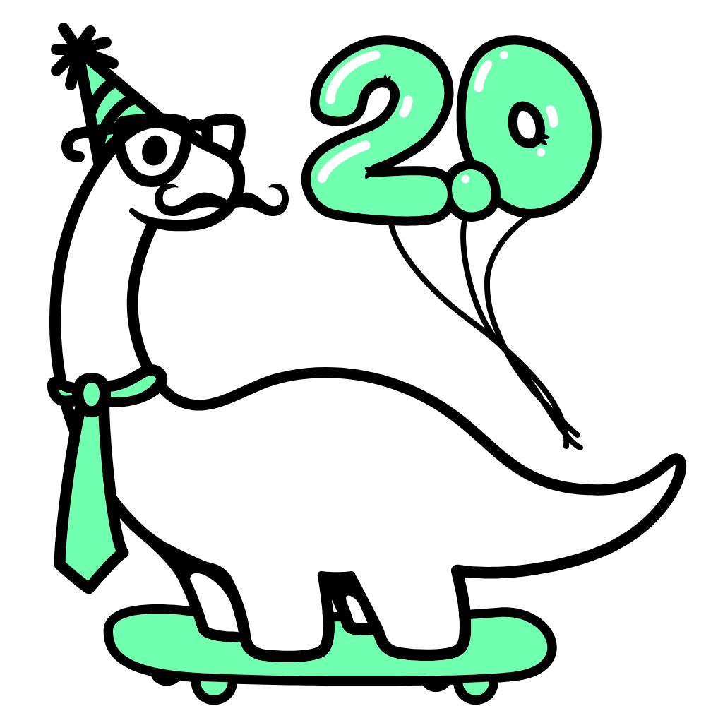

<div align="center">
    <h1>Callisto 🌙</h1>
    
    <br>
    <b>This is what I think Callisto would look like. Made using <a href="https://deno.com">Deno's Dinosaur Creator.</a></b>
</div>

---

## Version `0.1.1` 📝

- Added `<Client>.Once` method. This method is the same as `<Client>.On`, but it only runs once.
    - Example:
    ```ts
    client.Once("open", () => {
        Log.Info("Connected to the server!");
    });
    ```
- Added `<Client>.Off` method. This method is used to remove an event listener.
    - Example:
    ```ts
    const openEvent = () => {
        Log.Info("Connected to the server!");
    };

    client.On("open", openEvent);
    // This will remove the event listener.
    client.Off("open", openEvent);
    ```
- Added more consistent documentation to the following files:
    - `@/Main.ts`
    - `@/Utilities/Types.ts`
    - `@/Utilities/Logger.ts`

Update to this version by running the following command in your terminal:

```bash
deno add jsr:@nin0chat/callisto@0.1.1
```
